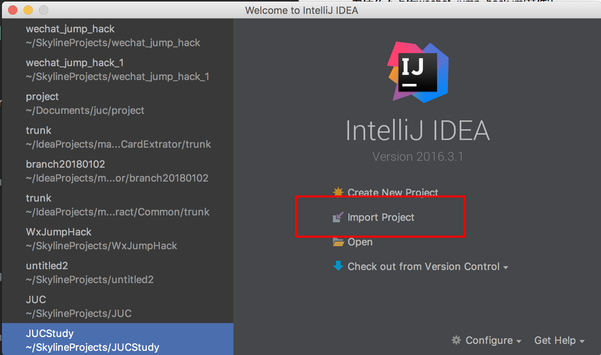
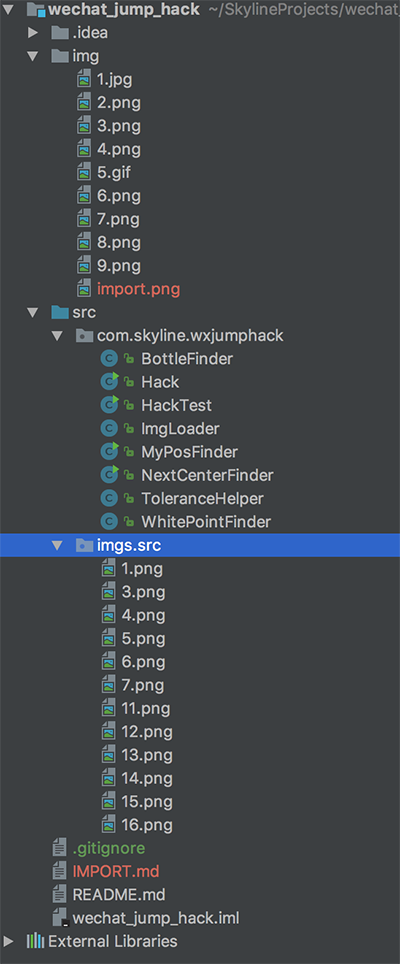
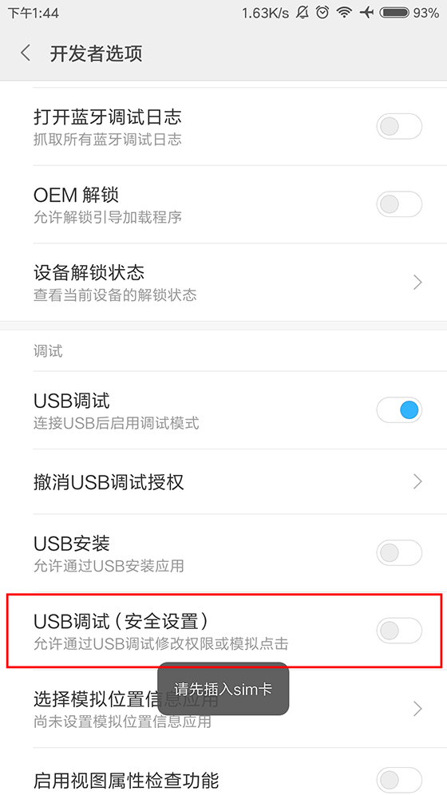
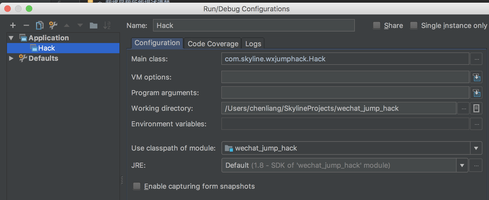
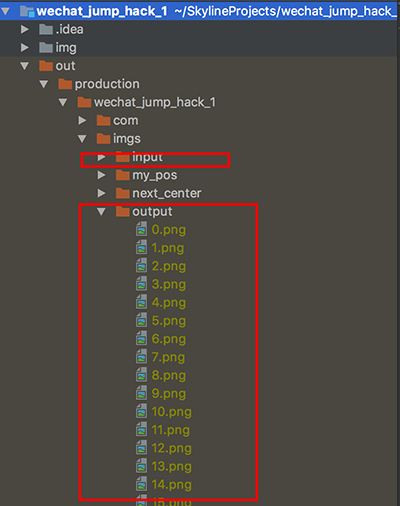
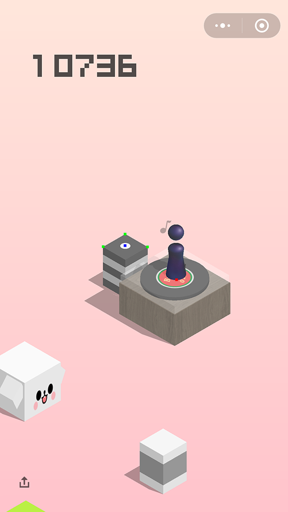

# Project import & Trouble shooting

我没有想到有那么多同学问我如何导入项目。主要的问题在于：

* 如何导入项目？
	* 我将尽我所能描述清楚。 
* 为什么不上传wechat\_jump\_hack.iml文件？
	* .impl文件指定这是一个Intellij的项目，并不是所有人都是用Intellij的；
	* .impl文件的名字会随着项目名称变化而变化，并不是所有的人clone在本地的项目名称是一样的；
	* .impl文件的内容随project struct的变化而变化，因此如果有人修改自己的project struct，它会发生变化;

因此.impl文件是肯定不能上传的，不然容易产生冲突。
		
## 笔者将以Intellij为例，说明如何导入项目：

1. 准备Java运行与编译环境，使用Java8以上，[参考链接](https://www.jianshu.com/p/0b240b541039)
2. 安装Android SDK，[参考链接](https://www.jianshu.com/p/4ac1313b50cb)
3. 使用 [git工具](https://www.jianshu.com/p/6a3332117efb)clone项目，地址为 https://github.com/burningcl/wechat_jump_hack

	运行命令
	
	```
	git clone https://github.com/burningcl/wechat_jump_hack wechat_jump_hack
	```
	
	结果如下：
	 
	```
	chenliangdeMacBook-Pro:SkylineProjects chenliang$ git clone https://github.com/burningcl/wechat_jump_hack wechat_jump_hack
	Cloning into 'wechat_jump_hack'...
	remote: Counting objects: 186, done.
	remote: Compressing objects: 100% (134/134), done.
	remote: Total 186 (delta 49), reused 148 (delta 28), pack-reused 0
	Receiving objects: 100% (186/186), 5.50 MiB | 234.00 KiB/s, done.
	Resolving deltas: 100% (49/49), done.
	```
	
	说明clone成功了。
	
4. 使用IDE import该项目

	如下图所示
	
	
	
	选择你已经clone到本地的项目的目录，然后一路点确定。
	
	导入成功后，可以看到目录结构如下：
	
	

5. 准备好一部已经打开开发者模式的Android手机；
6. 请确认是否adb已经联接上你的手机；如果adb连接失败，则会导致截图与拉取截图失败，提示“find myPos, fail”或者“找不到0.jpg”；如果连着多个Android设备的话，最好关到只有一个；
	
	运行命令`./adb devices`(windows环境下运行 adb devices，需要配置好环境变量)。如果结果如下，则说明adb连上了。
	
	```
	chenliangdeMacBook-Pro:platform-tools chenliang$ ./adb devices
	List of devices attached
	192.168.56.101:5555	device
	```

7. 打开开发者选项，找到“USB调试（安全设置）允许通过USB调试修改权限或者模拟点击”（在miui上是这样的，在其他手机上，应该也是差不多这样）这个开关，打开它；如果这个权限没有授予，则不能正常触发弹跳；

	
	
8. 修改com.skyline.wxjumphack.Hack中ADB_PATH，将其改为你自己的ADB位置；
9. 打开微信，打开跳一跳游戏，并点击开始；
10. 运行程序（Hack.java中的main方法）吧，骚年，观察它自动跳动；

	

## 如何确认识别是否准确？

1. 运行Hack.java中的main方法。运行一断时间后关掉。
2. 运行HackTest.java中的main方法。结果如下：

		
	
	查看output目录下的文件，位置标记的是否准确。像下面这种，就是非常不错的识别结果：
	
		
	
如果觉得跳得不准的同学，请运行HackTest.java文件，观察标记的位置是否准确。
如果不准确的话，根据反馈同学的经验：
* 请自行调整弹跳系数；
* 换一根好一点的数据线；
笔者无法做到我所用的弹跳系数适用于所有的设备。

## 启动时，IO异常，自定义的ADB_PATH路径拒绝访问

请参考： https://github.com/flutter/flutter-intellij/issues/1015

笔者无法做到我所用的弹跳系数适用于所有的设备。参考
笔者无法做到我所用的弹跳系数适用于所有的设备。

